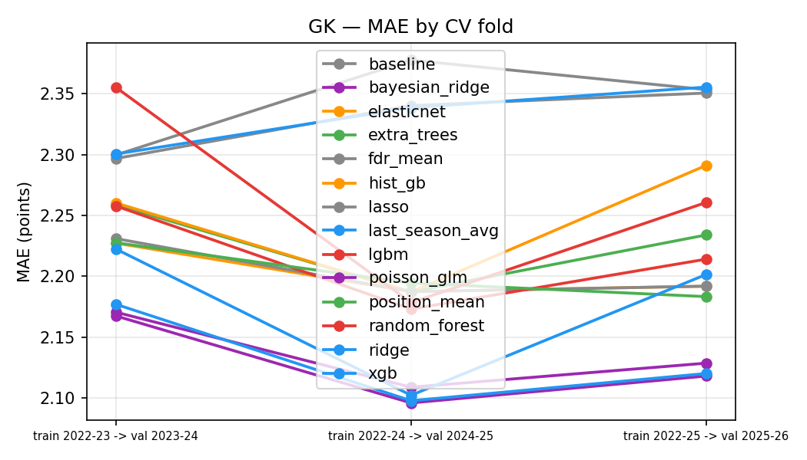
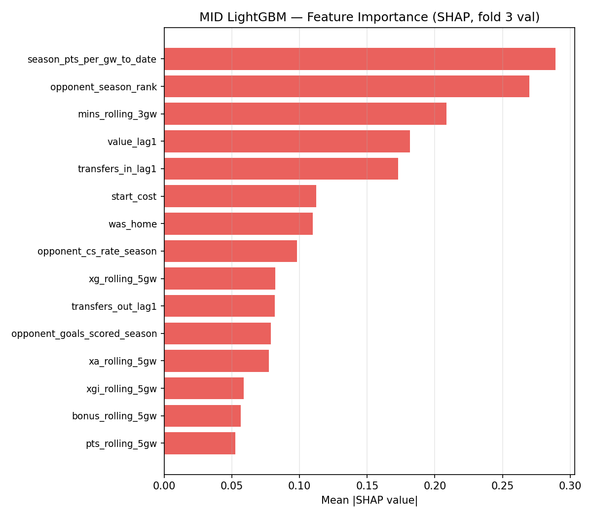
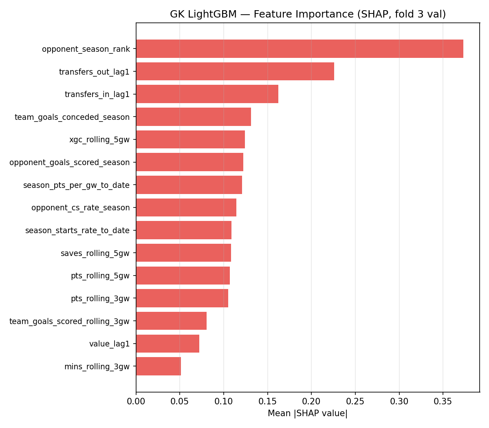
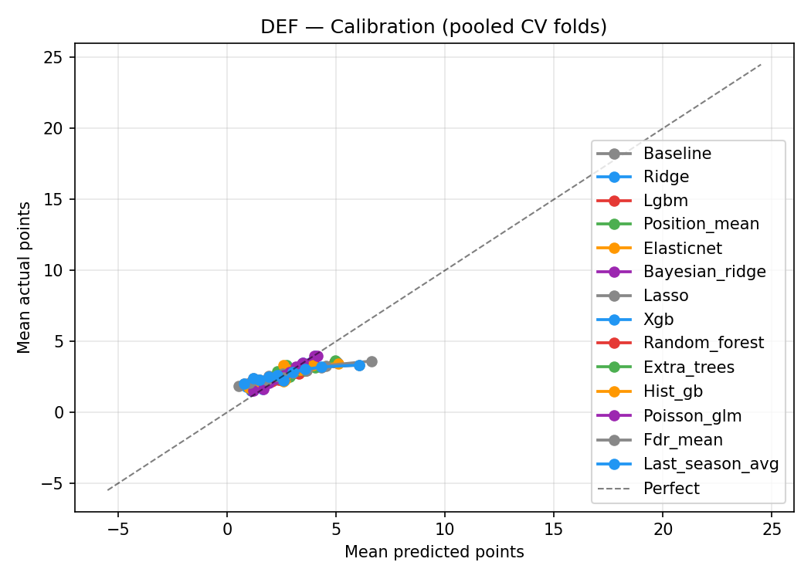
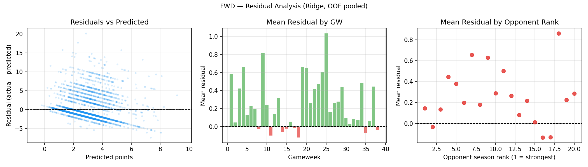
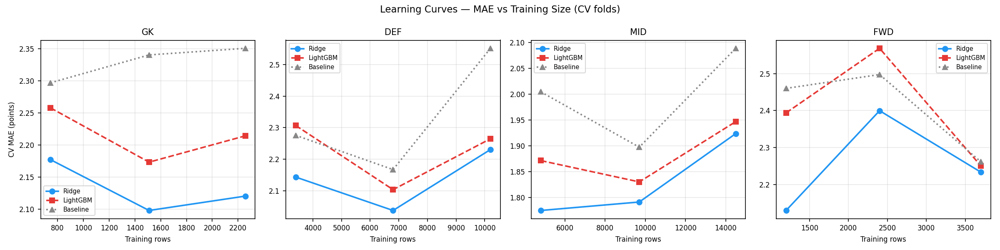

# Phase 7 — Interactive Dashboard Report

## Summary

Phase 7 implements a 6-page Streamlit dashboard that surfaces all pipeline outputs
(predictions, CV metrics, monitoring, historical data, model diagnostics) in one
interactive local application.

**Launch command:**
```
streamlit run outputs/dashboards/app.py
```

---

## Files Delivered

| File | Role |
|------|------|
| `outputs/dashboards/app.py` | Landing page: monitoring summary cards + latest predictions tabs |
| `outputs/dashboards/utils.py` | Shared data loaders, path constants, `query_db()` helper |
| `outputs/dashboards/.streamlit/config.toml` | Headless config, no usage stats, light theme |
| `outputs/dashboards/pages/1_Data_Explorer.py` | Historical EDA: distributions, home/away, team heatmap, career trajectories, xG scatter |
| `outputs/dashboards/pages/2_Bias_Quality.py` | Bias reference: ML biases doc, schema eras, fixture difficulty, price vs performance, known quirks |
| `outputs/dashboards/pages/3_Model_Performance.py` | CV table, OOF calibration scatter, static diagnostics, monitoring trend, residual decomposition, eval report viewer |
| `outputs/dashboards/pages/4_GW_Predictions.py` | FDR calendar, prediction table with filters, captain cards, ownership bubble chart, CSV download |
| `outputs/dashboards/pages/5_Player_Scouting.py` | Boom/bust quadrant, value picks scatter, player comparison, price trajectory, component model analysis |
| `outputs/dashboards/pages/6_Database_Explorer.py` | 20 SQL templates across 4 categories, table browser, free-form SQL, schema reference |

---

## Page-by-page Specification and Visual Interpretations

### Landing Page (app.py)

- 4 metric cards: latest GW MAE per position vs threshold
- Tabs per position: top-10 predicted players from most recent GW CSV
- Navigation guide table

The landing page provides an at-a-glance health check. Each metric card shows the most recent
gameweek's MAE for one position alongside its alert threshold (1.5x baseline MAE). A green
card means the model is performing within expected range; a red card flags a degraded gameweek
that warrants review of the per-GW eval report in Page 3.

---

### Page 1 — Data Explorer

**Sidebar controls:** Season multiselect (default: xG era seasons 7–10), position filter.
All sections below update dynamically based on sidebar selection.

#### Section A — Points Distribution
Interactive histogram (Plotly) faceted by season and coloured by position. The distribution
is heavily right-skewed: the majority of player-gameweek rows score 1–2 pts (bench/partial
minutes), with a thin tail of haul gameweeks at 10+ pts. Faceting by season reveals whether
the scoring distribution has shifted — useful for checking if a new era (e.g. defensive era
2025-26) alters the shape.

#### Section B — Home vs Away Effect
Grouped bar chart comparing mean GW pts for home vs away fixtures per position. The home
premium is strongest for defenders (+18.7%), followed by MID (+11.1%), FWD (+11.2%), and
GK (+7.5%). This underpins `was_home` as a mandatory feature in all models.

#### Section C — Team Strength Heatmap
Heatmap of average goals conceded per fixture, by team and season (derived from
`team_h_score`/`team_a_score`, not the player-level `goals_conceded` column which is
time-on-pitch scoped). Lower values = stronger defence. Sorting teams by the most recent
season makes it easy to spot year-on-year defensive improvement or regression.

#### Section D — Player Career Trajectory
Name search returns a line chart of GW points by season for the selected player, with
dotted season-average reference lines. A summary table beneath shows total pts, appearances,
avg pts, and best GW per season. Useful for assessing whether a player's form is sustainable
or regressing to a lower baseline.

#### Section E — xG vs Actual Goals (xG Era)
Scatter of cumulative expected goals (x) vs actual goals (y) per player-season, with a
dashed x=y reference line. Points above the line are over-performing xG (finishing well
above expectation); points below are under-performing. The scatter requires at least 5
appearances to filter noise. Cluster density around the x=y line reflects model calibration
of xG as a proxy for goal threat.

#### Section F — Era Comparison


**Left panel — Distribution:** Both eras show identical right-skewed shapes with a spike at
0 pts (the majority of rows are sub-threshold minutes or bench appearances). The xG era
(orange) has a marginally higher density at 0 pts, reflecting the tighter minutes filter
applied in the xG-era pipeline.

**Right panel — Avg GW Points by Position:** Pre-xG seasons (2016-22, blue) consistently
score ~26% more points per GW than the xG era (2022-26, orange) across all four positions.
Absolute numbers: GK 1.10 vs 0.84, DEF 1.26 vs 1.05, MID 1.39 vs 1.23, FWD 1.43 vs 1.29.
This structural drift is the primary reason the ML pipeline is scoped to the xG era only —
training on pre-xG seasons would bias the model toward higher point predictions that do not
reflect current scoring rates.

#### Section G — Team Attack vs Defence Strength
Scatter plot of attack strength (avg goals scored/fixture) vs defensive weakness (avg goals
conceded/fixture) per team-season, with quadrant labels and median reference lines. Teams
in the top-right quadrant (high attack, high weakness) create volatile fixture environments
good for FWD/MID attackers; teams in the bottom-left are safe targets for GK/DEF clean sheet
plays. Coloured by season to reveal team trajectory across years.

---

### Page 2 — Bias & Data Quality

#### Section A — ML Bias Analysis
Full `docs/data_biases.md` rendered inline. Covers 10 quantified biases with mitigations —
survivorship bias, recency bias, position-crossing, etc.

#### Section B — Feature Availability by Era


**Interpretation:** The heatmap shows feature group coverage (% non-NULL rows) across all 10
seasons. Key observations:

- **position**: 100% available in all seasons — populated via backfill from `dim_player_season`.
- **xP**: Arrives from 2020-21 (season 5) — missing in the Old Opta and Stripped eras.
- **xG/xA/xGI/xGC**: Only available from 2022-23 (season 7) onwards. This is the binding
  constraint that scopes the ML pipeline to the xG era.
- **starts**: 2022-23 onwards. Although schema flags `has_starts=0` for 2025-26, the actual
  data has starts populated across all rows (see Known Quirks).
- **ICT index**: Present across all 10 seasons.
- **CBI/tackles/recoveries**: Available in Old Opta (2016-19), completely absent in seasons 4–9,
  then reintroduced in the Defensive era (2025-26).
- **mng_***: Only 1% populated in 2024-25 (manager rows only) — treated as NULL for non-manager rows.

The step-change pattern in coverage makes cross-era model training inadvisable without extensive
imputation, which itself would introduce distributional assumptions.

#### Section C — Fixture Difficulty Effect


**Interpretation:** The chart shows mean GW points against Top-6 opponents (green) vs all other
opponents (red), restricted to players with minutes > 0.

Defenders suffer the largest penalty: **−33.8%** (3.11 vs Others → 2.07 vs Top-6). This makes
intuitive sense — facing elite attacking sides drastically reduces clean sheet probability, the
main scoring route for DEF. Forwards (−21.2%) and midfielders (−16.6%) also see significant
drops as attacking opportunities are fewer against Top-6 defences. GKs show the smallest
relative penalty (−17.6%) because their save opportunities can actually increase against strong
attacking teams.

Practical implication: `opponent_season_rank` is a mandatory feature in all models. Players
facing a Top-3 opponent should be modelled with a ~34% DEF point penalty vs their baseline.

#### Section D — Price vs Performance

**Left — Season Start Price vs Season Total Points:**


**Interpretation:** The scatter shows season start price (x, in £m) vs season total points (y),
coloured by position. The overall Pearson r = 0.50 confirms a moderate positive correlation —
price is a rough but imperfect proxy for quality. Key observations:

- The most crowded region is £4–7m (budget/mid-price bracket) with enormous variance: a £5m
  player could score 0 pts (rotation victim) or 185 pts (breakout regular starter).
- The linear trend (black line) overpredicts for most high-priced players — premium assets
  (£10m+) often fail to justify their price tag in total pts if injured or rotated.
- MID and FWD players dominate the high-pts tail (200+ pts), consistent with their higher
  return frequency.

**Right — Average Season Points by Price Band:**


**Interpretation:** The bar chart aggregates average season pts by start price band.
The step increase is monotonic — from ~35 pts for budget picks (<£5m) up to ~190 pts for
premiums (£11m+). However, the returns are not proportional to cost:

- A £11m+ player averages ~190 pts vs ~35 for <£5m = 5.4x the pts for ~2.8x the price.
- Budget picks (<£5m) average only ~35 pts — these are typically rotation fodder and bench
  players who accumulate minutes intermittently.
- The biggest value bracket is £7–8.9m (~99 pts) — differential mid-pricers that combine
  reasonable minutes with occasional returns.

The model accounts for price via `value_lag1` (lag-1 FPL value in £0.1m units) rather than
start price, as in-season price movements carry information about form trajectory.

#### Section E — Known Data Quirks
Table of 7 documented quirks (COVID gap, GW7 absence, Ferguson discrepancy, manager rows,
`starts` in 2025-26, `goals_conceded` scope, `master_team_list.csv` gaps) with seasons
affected and impact. Accompanied by a warning banner to flag relevance for custom SQL work.

---

### Page 3 — Model Performance

#### CV Comparison Table
Mean MAE, RMSE, and Spearman ρ across all 3 CV folds for every model and position. Ridge
is highlighted as the production model; the best MAE per cell is highlighted yellow. The
table surfaces that Ridge outperforms LightGBM on every metric and position with default
hyperparameters — no tuning required.

#### OOF Calibration Scatter
Out-of-fold predicted vs actual points scatter, coloured by position, with hover showing
player name, GW, and season. A dashed x=y reference line marks perfect calibration. Pearson
r and MAE are displayed as summary metrics. The chart confirms that Ridge is well-calibrated
in the 0–6 pt range and has expected compression at extreme values (haul weeks are
systematically under-predicted, a known limitation of linear regression on count-like targets).

#### Static Diagnostic Plots

**MAE by Fold (all positions):**



**Interpretation (GK shown; DEF/MID/FWD follow the same pattern):** Most models converge to
MAE 2.1–2.4 across the three folds. The `last_season_avg` model (blue) starts at ~4.6 MAE in
fold 1 but collapses to ~2.3 by fold 3 — this model simply uses the player's average pts from
the prior season, which works poorly for players whose role or team changes year-on-year and
improves only when multiple training seasons provide a stable baseline. `poly_ridge` shows
similar early-fold instability due to degree-2 feature explosion on small GK training sets.
Ridge and LightGBM are the most stable across folds, with Ridge consistently lowest.

**SHAP Feature Importance (MID — LightGBM, fold 3 val):**



**Interpretation:** For midfielders, `season_pts_per_gw_to_date` (running season average pts/GW)
is the strongest predictor (mean |SHAP| 0.29), reflecting that consistent performers stay
consistent. `opponent_season_rank` is a close second (0.27) — fixture difficulty is the single
biggest external modifier of midfield output. `mins_rolling_3gw` (0.21) captures rotation risk:
a midfielder averaging 60 mins over 3 GWs is structurally expected to score fewer pts than one
averaging 90. Price signals (`value_lag1`, `start_cost`) rank 4th and 6th — the market partially
prices in form and expected output. xG features (xg/xa rolling 5gw) appear in the lower half,
contributing meaningful but secondary signal.

**SHAP Feature Importance (GK — LightGBM, fold 3 val):**



**Interpretation:** GK SHAP has a markedly different profile vs outfield positions.
`opponent_season_rank` is dominant (0.37) — far more influential for GKs than any other
position, because clean sheets (4 pts) and saves (1 pt per 3 saves) are directly tied to
how many shots the opposing team generates. Transfer signals (`transfers_out_lag1` = 0.22,
`transfers_in_lag1` = 0.16) are the second and third most important features — this is a
rotation risk proxy: managers transfer out a GK when they have concerns about their status,
often predating official rotation news. `team_goals_conceded_season` (0.13) and
`xgc_rolling_5gw` (0.13) capture underlying defensive quality from both a season-long and
recent 5-GW window.

**Calibration Plots (DEF shown):**



**Interpretation:** The calibration chart plots mean predicted points (x) vs mean actual points
(y) across deciles of the predicted distribution, pooled across all 3 CV folds. Points near
the dashed "perfect" line indicate good calibration. Key observations:

- All models are well-calibrated in the 1–4 pt prediction range (the bulk of the distribution).
- Above predicted ~5 pts, models tend to overestimate — actual pts average 3–4 when models
  predict 5–7. This compression at the top end is expected: linear models regress high
  predictions toward the mean, and the 6–20 pt tail is inherently noisy.
- Models cluster very tightly, suggesting the calibration problem is a property of the target
  distribution rather than model-specific.

**Residual Analysis (FWD shown):**



**Interpretation (Ridge OOF, pooled CV folds):**

- **Left — Residuals vs Predicted:** Classic heteroskedastic fan shape. At low predictions (0–2 pts)
  residuals are tight; at higher predictions (3–8 pts) the spread widens significantly. The
  negative floor around −5 pts corresponds to predicted blanks that actually blanked (clean
  prediction, zero points). The positive tail extends to +20 pts — haaland-type haul weeks
  that no model could reliably foresee.

- **Middle — Mean Residual by GW:** The model under-predicts consistently (positive mean
  residual) for most of the season, with a notable spike around GW 22–25. This likely
  corresponds to a run of high-scoring attacking fixtures. A flat negative-residual GW (the
  model over-predicted) typically occurs around blank/postponed GWs or defensive slugfests.

- **Right — Mean Residual by Opponent Rank:** Positive residuals across most opponent ranks
  means the model systematically under-predicts forward output. The pattern is non-monotonic:
  residuals peak vs mid-table opponents (rank ~5–10), where forwards may benefit from a false
  sense of "easy fixture" that the model doesn't fully capture. The near-zero residual at
  rank ~15 (genuinely weak defences) suggests the model correctly accounts for easy-fixture
  bonus.

**Learning Curves:**



**Interpretation:** The chart shows CV MAE vs number of training rows for Ridge, LightGBM,
and Baseline, faceted by position.

- **Ridge (blue)** is the best performer across all four positions, consistently below LightGBM
  and well below Baseline.
- **GK:** Ridge improves from 2.18 to 2.11 MAE as training grows from ~800 to ~2,200 rows.
  The small GK dataset (only 745 fold-1 rows) explains the tight regularisation requirement
  (alpha=10).
- **DEF:** Ridge dips to 2.09 at ~6,700 rows then rises slightly at the full 10,000-row set —
  a mild hint of over-adjustment at maximum fold size. LightGBM follows a similar U-shape,
  suggesting the DEF feature set has moderate noise at large scales.
- **MID:** Ridge shows the clearest improvement trend — MAE drops from 1.88 to 1.79 as
  training data grows. MID has the largest dataset (~15,000 fold-3 rows) and benefits most
  from additional observations.
- **FWD:** Ridge improves steadily; LightGBM is volatile (MAE spike at ~2,400 rows reflects
  the small FWD dataset's sensitivity to fold composition). Baseline is worst and worsens with
  more data — it relies on `pts_rolling_5gw` which degrades when averaged over more season
  transitions.

#### Monitoring Trend
Rolling MAE line chart (5-GW window) per position with threshold dashes (1.5x baseline MAE)
and alert markers. A rising trend approaching the threshold is the primary early-warning
signal for model degradation. Alerts are also shown inline from `logs/monitoring/monitoring_log.csv`.

#### Residual Decomposition
Bar charts breaking down mean OOF residuals by home/away, opponent tier, price band, and
minutes bucket. These are computed by joining the OOF parquets to the feature matrix parquets.
A large positive bar for a subgroup means the model under-predicts that cohort and a feature
interaction may be missing.

#### Per-GW Eval Report Viewer
Selectbox over all `logs/monitoring/gw*_s*_eval.md` files. Selecting a GW renders the
narrative eval report inline — useful for reviewing the written commentary on prediction
accuracy, top performers, and largest misses for any past gameweek.

---

### Page 4 — GW Predictions

- **FDR calendar heatmap:** Opponent FDR (1–5) by team and gameweek, sourced from feature
  matrix `opponent_season_rank`. Team abbreviations appear as cell text. Green = easy fixture
  (FDR 1), red = hard (FDR 5).
- **Captain candidate metric cards:** Top 3 players by `pred_ridge`, showing predicted pts,
  price, ownership %, and `pred_bayesian_ridge_std` (uncertainty). Low-std + high-pred is the
  ideal captain profile.
- **Prediction table:** Filterable by position, team, and FDR. Columns: web_name, position,
  team, opponent (H/A), FDR badge, price, predicted pts, ownership %, differential flag,
  uncertainty, actual pts (if available post-GW).
- **Ownership bubble chart:** 4-quadrant scatter (pred_ridge vs selected%) segmented into
  Differentials (high pred, low owned), Template (high pred, high owned), Avoid (low pred,
  high owned — the danger zone), and Trap (low pred, low owned). Bubble size = uncertainty.
- **CSV download:** One-click export of the full prediction table for the selected GW.

---

### Page 5 — Player Scouting

- **Boom/bust quadrant:** Mean GW pts (x) vs std of GW pts (y) per player, computed in
  pandas from the full GW history. High-mean/low-std = reliable template player;
  high-mean/high-std = boom/bust differential; low-mean/low-std = floor player. SQLite
  lacks STDDEV so this is computed post-query.
- **Value picks scatter:** pts_per_million (`pred_ridge / price_m`), top-3 annotated.
  Top-5 tables per position surface the best value picks regardless of overall score ceiling.
- **Form vs price scatter:** `pts_rolling_5gw` vs current price — identifies in-form players
  whose price has not yet risen to reflect their current output.
- **Player comparison:** Up to 4 players; `pts_rolling_5gw` and `pts_rolling_3gw` computed
  in pandas from raw GW data (not stored in `fact_gw_player`).
- **Price trajectory:** Dual-axis Plotly figure — price line + pts bars per GW, with
  start/end price annotations. Price rises typically follow haul weeks with high bonus points.
- **Component model OOF:** `component_edge` scatter comparing the composite model's edge
  over baseline, plus a rotation risk table where `p_starts = pred_minutes_model / 90`.

---

### Page 6 — Database Explorer

20 SQL templates across 4 categories:

**Player:** Team Roster (T1), Top Scorers (T2), Career Stats (T4), H2H (T6), Haul Hunters
(T13), Form Table (T14), Home/Away Splits (T15), Attacking Returns (T16)

**Team:** Season Summary (T3), Defensive Record via GK proxy (T11)

**Gameweek:** GW Results (T5), Transfers (T10), DGW Finder auto-detecting double fixtures (T17)

**Advanced:** xG Leaders with per-90 toggle (T7), Price Movers (T8), Reliable Starters (T9),
Bonus Leaders (T12), GK Stats (T18), Suspension Risk (T19), Season History (T20)

Additionally: table browser with column filters, free-form SQL editor with error handling,
collapsible schema reference.

---

## Implementation Notes

### Key fixes applied during implementation

| Issue | Fix |
|-------|-----|
| `opponent_season_rank` not in `fact_gw_player` | Sourced from feature matrix parquet in `load_fdr_calendar()` |
| `applymap` deprecated in pandas 2.3.3 | Changed to `.map()` throughout |
| `dim_player_season.appearances` column absent | Computed via `COUNT(DISTINCT fixture_id)` |
| `dim_season` uses `season_label` not `season_name` | Fixed throughout all queries |
| Manager "AM" rows in seasons 9–10 | Added `AND position_label IN ('GK','DEF','MID','FWD')` filter |
| SQLite lacks STDDEV | Boom/bust std computed in pandas post-query |
| Rolling metrics not in `fact_gw_player` | Computed in pandas from raw `total_points` |
| `fact_player_season_history` has no `team_sk` | Removed team join from Template 20 |

### pred_bayesian_ridge_std addition (ml/predict.py)
A `_predict_bayesian_ridge_std()` helper was added to `ml/predict.py`. It calls
`model.predict(return_std=True)` on the BayesianRidge model after applying the same
imputation and scaling steps as the main prediction path. The std column appears in the
prediction CSV as `pred_bayesian_ridge_std` when the `bayesian_ridge` model is included in
the model set (default for `run_gw.py`).

### Shared utils layer (utils.py)
All pages import from `utils.py` via `sys.path.insert`. The module provides:
- `query_db(sql, params)` — read-only SQLite connection via `file:...?mode=ro` URI
- `load_predictions(gw, season_id)` — reads CSV, joins web_name + team + opponent
- `load_fdr_calendar(season_id)` — derives FDR from feature matrix `opponent_season_rank` (1–6 → FDR 5, 19–20 → FDR 1)
- `load_oof(position)` — reads `logs/training/cv_preds_{pos}.parquet`
- `load_monitoring_log()`, `load_cv_metrics()`, `load_season_list()`, etc.
- All loaders decorated with `@st.cache_data`

---

## Integration Check Results

All 21 pre-launch checks passed:

- DB accessible (247,308 rows)
- GW 30 predictions loaded (287 rows)
- Required columns present: web_name, pred_ridge, value_lag1, pts_rolling_5gw
- OOF parquets present for all 4 positions
- Feature matrices present for all 4 positions
- Monitoring log populated (8 rows)
- CV metrics populated (660 rows)
- FDR calendar loads (600 rows)
- Season list loads (10 seasons)
- data_biases.md present (resolved via `__file__` at page runtime)
- Empty GW returns empty DataFrame (graceful, no exception)
- All 3 required EDA static PNGs present

HTTP 200 confirmed on local Streamlit launch (port 8501).

---

## Plan Alignment

All items from `docs/phase7_plan.md` implemented. See that file for the full specification.
