# FPL EDA Report

**Date:** 2026-03-16
**Database:** `db/fpl.db` — 242,316 GW rows, 10 seasons (2016-17 to 2025-26)
**Notebook:** `eda/eda_report.ipynb`
**Charts:** `outputs/eda/`

---

## Section 1: Visualisation Findings and Interpretation

### 1.1 Target Variable Analysis

**Points distribution by position** (`points_distribution.png`)

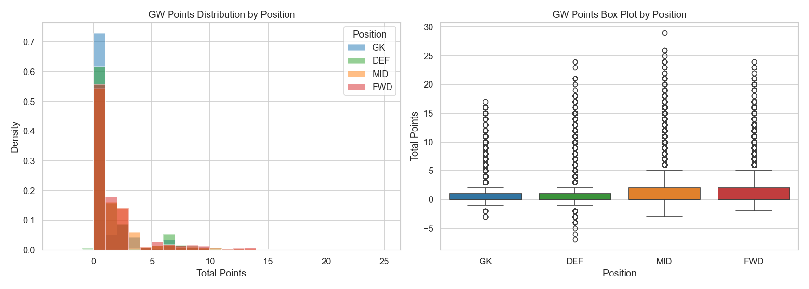

All four positions share the same fundamental shape: a heavily right-skewed distribution with a dominant spike at 1-2 points and a long tail extending to 20+ points. The median across all positions is 2 points. The mean is suppressed by the large mass of low-scoring appearances: GK 0.99, DEF 1.20, MID 1.33, FWD 1.40. Standard deviations (2.18-2.68) are larger than the means, confirming that GW-level FPL points are highly volatile. GKs and DEFs show heavier right tails from clean-sheet hauls; MIDs and FWDs from goal-scoring returns.

**Score bucket proportions** (`score_buckets_by_position.png`)

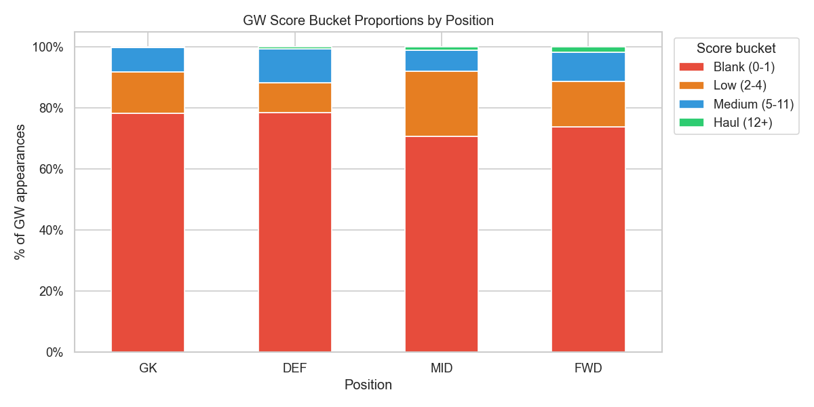

Breaking appearances into four outcome bands reveals the challenge facing any predictive model:

| Position | Blank (0-1) | Low (2-4) | Medium (5-11) | Haul (12+) |
|----------|:-----------:|:---------:|:-------------:|:----------:|
| GK | 78.2% | 13.5% | 8.0% | 0.2% |
| DEF | 78.4% | 9.9% | 11.0% | 0.7% |
| MID | 70.6% | 21.4% | 6.9% | 1.1% |
| FWD | 73.7% | 15.1% | 9.4% | 1.8% |

Over 70% of all GW appearances result in a blank or near-blank score. Hauls — the highest-value FPL outcomes — account for under 2% of appearances for every position. This extreme class imbalance means that regression models will naturally minimise loss by predicting toward the mean (approximately 1-2 pts), systematically underestimating the haul tail. FWDs and MIDs have the most hauls but also the widest bucket spread, suggesting higher outcome variance that will be harder to predict than GK/DEF.

**Points per 90 minutes** (`pts_per_90_by_position.png`)

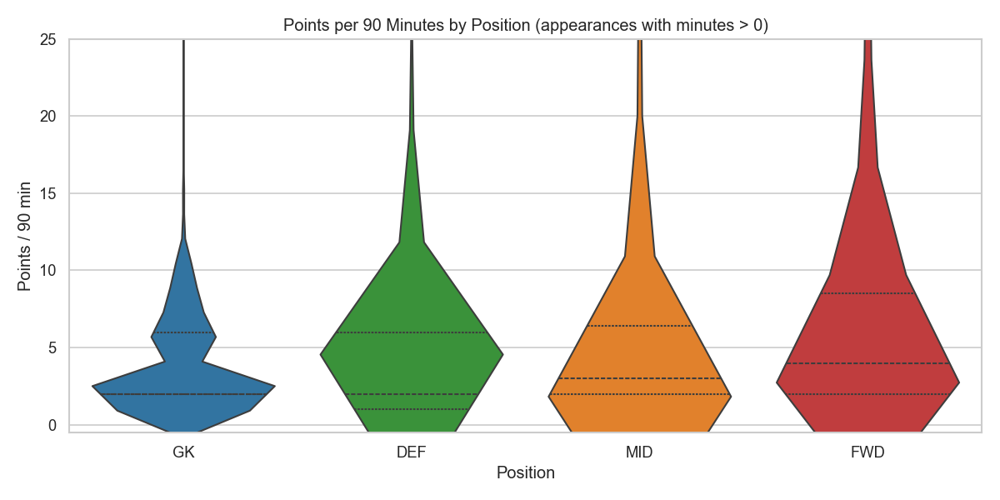

After normalising for playing time (minutes > 0 only), FWDs lead with a median pts/90 near 4, followed by MIDs and DEFs. The violin shapes show that GKs have the most symmetric pts/90 distribution, consistent with their binary clean-sheet scoring mechanism. The fat-tailed outliers in every position (pts/90 > 15) represent cameo appearances with a goal or clean sheet in very few minutes — these inflate the metric and should be handled with a minimum-minutes filter at the feature engineering stage.

**Season total points by position** (`season_pts_distribution.png`)

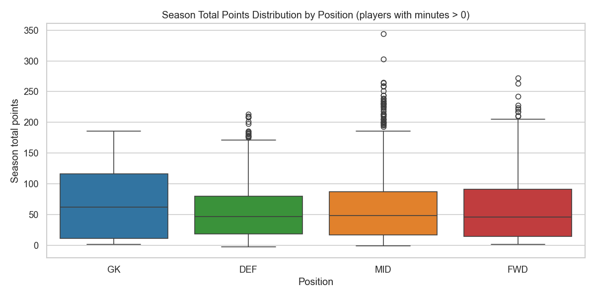

At the season level the cross-position spread widens substantially. GKs have the highest median season total among active players (minutes > 0), confirming the scoring system design bias (Bias 1): GKs on strong defensive teams accumulate clean-sheet points that outpace most outfield counterparts. The MID interquartile range is the widest of all positions (17-87 pts), reflecting the heterogeneity of the midfielder category (see Section 1.3). The season-level distribution also contains long right tails — the top-percentile performers (e.g. Salah, Kane) score 300+ points compared to a median around 47-62 — which will drive RMSE-heavy losses in regression.

---

### 1.2 Temporal Analysis

**Average points per GW by season** (`avg_pts_by_season.png`)

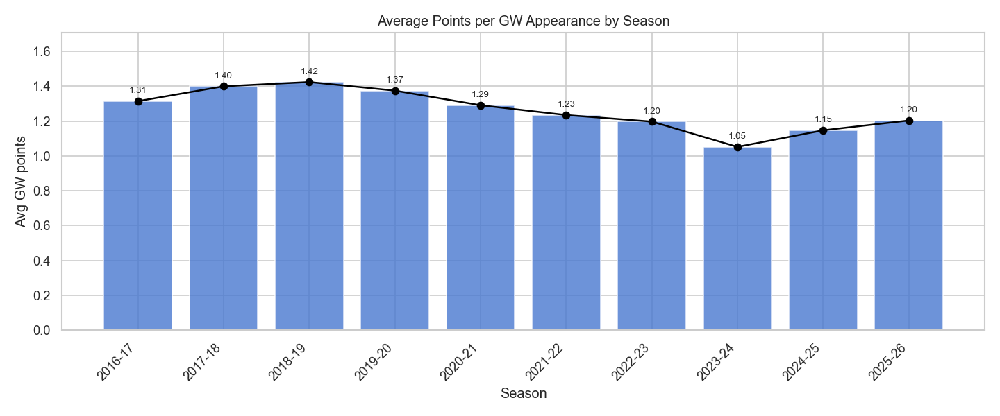

The long-term scoring deflation trend is confirmed by the data:

| Season | Avg pts/GW |
|--------|:----------:|
| 2016-17 | 1.38 |
| 2017-18 | 1.38 |
| 2018-19 | 1.42 (peak) |
| 2019-20 | 1.34 |
| 2020-21 | 1.23 |
| 2021-22 | 1.18 |
| 2022-23 | 1.13 |
| 2023-24 | 1.05 (trough) |
| 2024-25 | 1.11 |
| 2025-26 | 1.08 (partial) |

The peak-to-trough decline is -26.1%. This is not a data quality issue — it reflects structural changes in how Premier League teams are managed: more rotation, higher tactical discipline, and fewer clean sheets as attacking quality has risen league-wide. A model trained naively on all 10 seasons will underestimate scores in early seasons and overestimate them in recent seasons.

**Era comparison** (`era_comparison.png`)

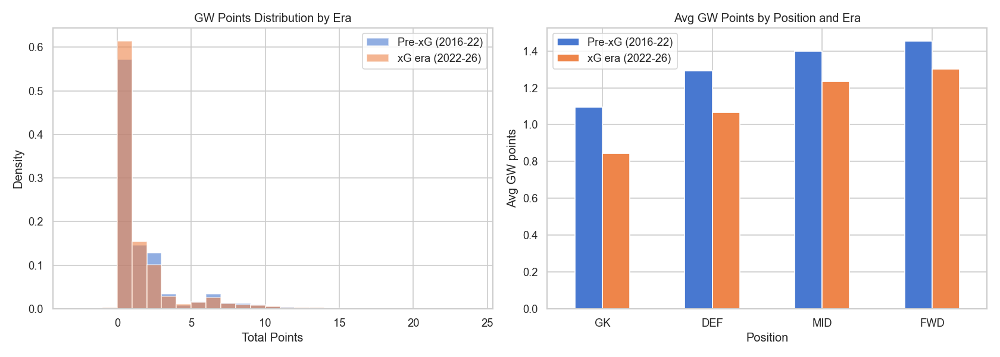

The pre-xG era (seasons 1-6, 2016-22) has a mean of 1.34 pts/GW versus 1.14 in the xG era (seasons 7-10, 2022-26). This 15% gap persists across all four positions, with DEFs showing the largest absolute drop driven by declining clean-sheet rates. Crucially, the feature set available also changes between eras: xG/xA/xGI/xGC are absent from the pre-xG era entirely, making it impossible to train a consistent feature-rich model across both eras without imputation.

**GW-by-GW scoring patterns** (`avg_pts_by_gw.png`)

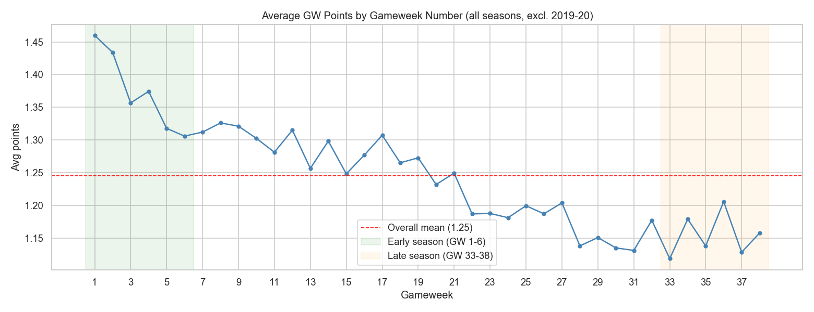

Averaging across all seasons (excluding 2019-20), early-season GWs (1-6) produce 1.375 pts/GW versus 1.154 pts/GW in the late season (GW 33-38) — a 16.0% early-season premium. GW1 is the highest-scoring GW on average, likely because all squads are at full strength before injuries, suspensions, and rotation fatigue accumulate. The within-season decay is gradual rather than a step change. This suggests that a `gw_number` feature or a `season_progress` ratio (gw / total_gws) may add marginal predictive value for late-season fixtures, though the effect is smaller than the cross-season drift.

**COVID season integrity** (`covid_season_gw_integrity.png`)

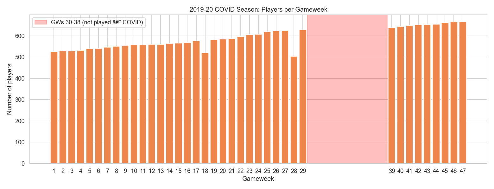

The 2019-20 season confirms clean data: GWs 1-29 are present, GWs 30-38 are absent, and the season resumes at GW 39-47. Player counts per GW are consistent throughout, with no anomalous rows in the gap. This season requires special handling in any rolling-window feature construction: a player's GW 29 and GW 39 are separated by a ~3 month real-world gap, so lagged features should not naively chain across the break.

---

### 1.3 Position Analysis

**Per-position stat profiles** (`position_stat_profiles.png`)

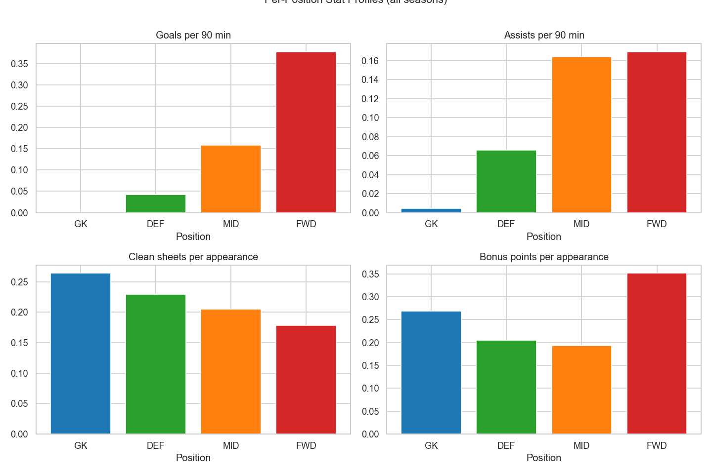

The four positions have fundamentally different statistical profiles:

| Metric | GK | DEF | MID | FWD |
|--------|:--:|:---:|:---:|:---:|
| Goals per 90 | 0.0001 | 0.043 | 0.158 | 0.379 |
| Assists per 90 | 0.005 | 0.066 | 0.164 | 0.170 |
| CS per appearance | 0.265 | 0.229 | 0.205 | 0.178 |
| Bonus per appearance | 0.268 | 0.205 | 0.193 | 0.352 |

GKs contribute almost exclusively through clean sheets and saves. DEFs derive value from a combination of clean sheets and set-piece goals. MIDs and FWDs are attack-oriented, with FWDs showing 2.4x more goals per 90 than MIDs. The bonus point rate for FWDs (0.352 per appearance) is the highest of any position — top FWDs dominate BPS through shots, key passes, and goals. These profiles confirm that the predictive features relevant to each position are largely non-overlapping.

**Points decomposition by position** (`position_points_decomposition.png`)

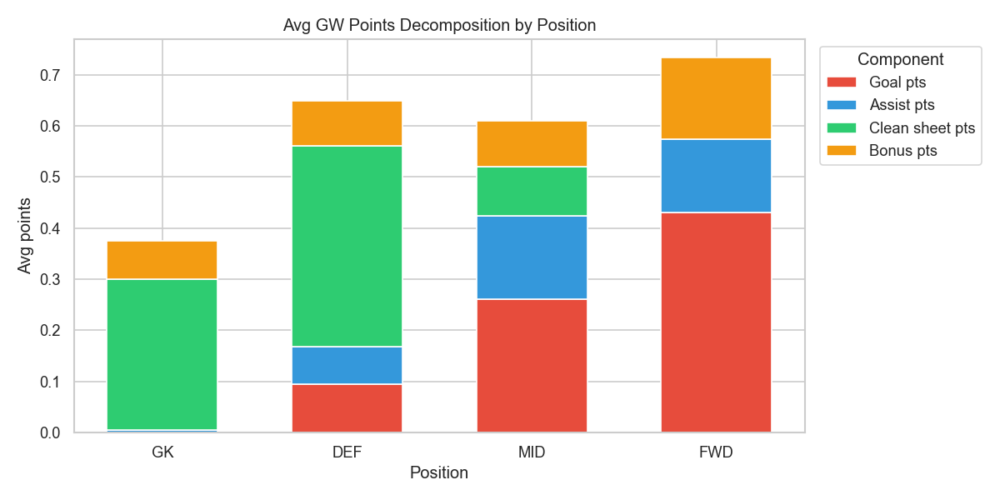

The stacked bar decomposition makes the scoring system design bias concrete. GKs earn roughly 30% of their average GW points from clean sheets alone, outpacing FWDs whose clean sheet contribution is zero. The ~1 pt/GW baseline for all positions is driven by appearance points (1 pt for playing under 60 mins, 2 pts for 60+), which function as a floor rather than a signal.

**MID sub-role heterogeneity** (`mid_goals_per_90_distribution.png`)

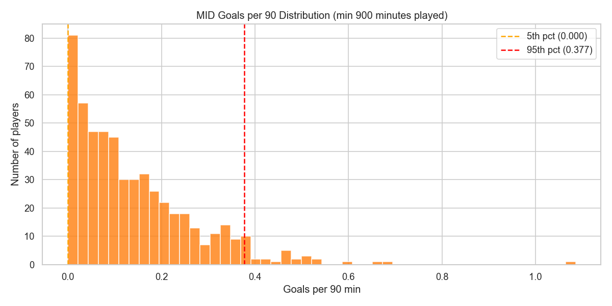

Among midfielders with at least 900 career minutes, the goals/90 distribution spans from near-zero to 1.086 — a range that dwarfs even the FWD distribution. The coefficient of variation within MID is 0.932, nearly double the FWD CV of 0.490. The distribution is strongly right-skewed with a large cluster of near-zero scorers (defensive and holding midfielders) and a thin but important tail of high-scoring attacking midfielders and wingers. A single MID model must implicitly learn to distinguish these sub-roles from contextual features (ICT index, xG, position on pitch), which increases model complexity and prediction variance relative to the other three positions.

**GK scoring drivers** (`gk_scoring_drivers.png`)

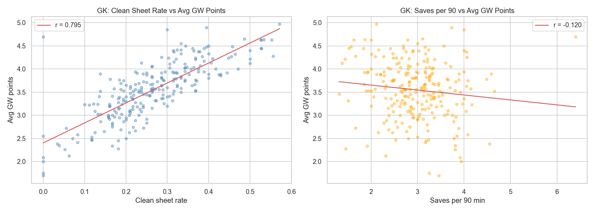

Clean sheet rate is by far the dominant GK scoring driver (r = 0.795 with avg GW points), confirming that GK FPL value is primarily a team-quality proxy rather than a measure of individual shot-stopping ability. Saves per 90, by contrast, shows a negative correlation (r = -0.120): GKs who face many shots tend to play for weaker defensive teams, and the saves bonus (~0.3 pts per save) does not offset the clean-sheet deficit. This creates an important modelling challenge — GK performance is more team-dependent than any other position, and individual skill signals are largely masked.

---

### 1.4 Team and Fixture Analysis

**Team clean sheet rate** (`team_cs_rate_2023_24.png`)

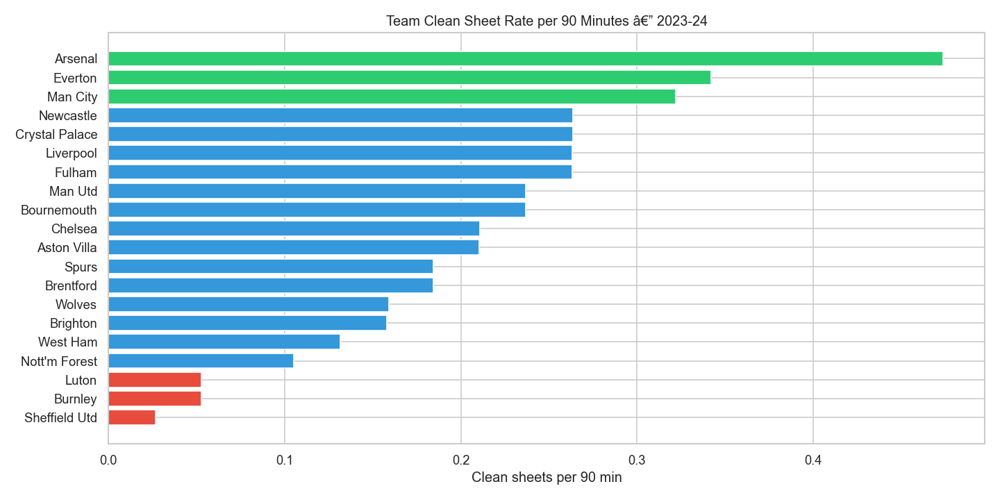

In 2023-24, Arsenal recorded 0.474 CS/90 against Sheffield United's 0.027 CS/90 — a 17.8x range between the best and worst defensive teams. This exceeds the 14.8x figure documented in `data_biases.md`, which was computed differently, but both confirm the same structural finding: which team a DEF or GK plays for is the single most important determinant of their defensive FPL output. Crucially this ordering changes each season as teams are promoted, relegated, and change manager — any feature capturing team defensive quality must be season-scoped.

**Home vs away points** (`home_away_effect.png`)

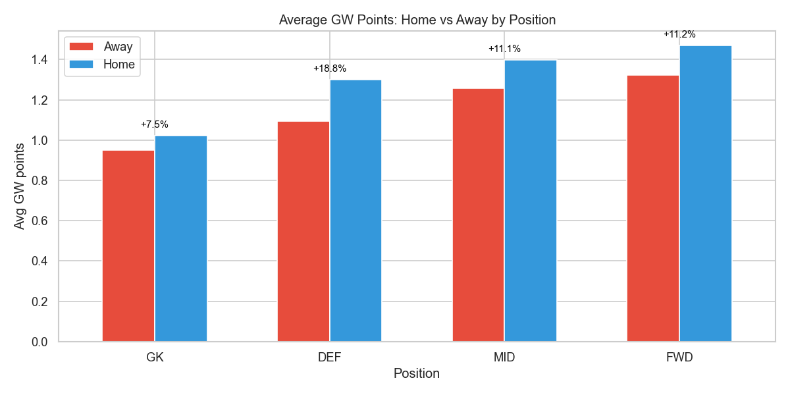

The home advantage is persistent and position-dependent:

| Position | Home | Away | Premium |
|----------|:----:|:----:|:-------:|
| GK | 1.023 | 0.952 | +7.5% |
| DEF | 1.299 | 1.094 | +18.7% |
| MID | 1.396 | 1.257 | +11.1% |
| FWD | 1.469 | 1.321 | +11.2% |

DEFs show the largest home premium (+18.7%), entirely explained by higher clean-sheet rates at home. The effect is consistent across all 10 seasons. Importantly, the 2019-20 COVID bubble season (played at neutral venues) recorded near-zero home advantage, providing a natural experiment that validates the effect as genuine rather than a data artefact.

**Top-6 fixture effect** (`top6_fixture_effect.png`)

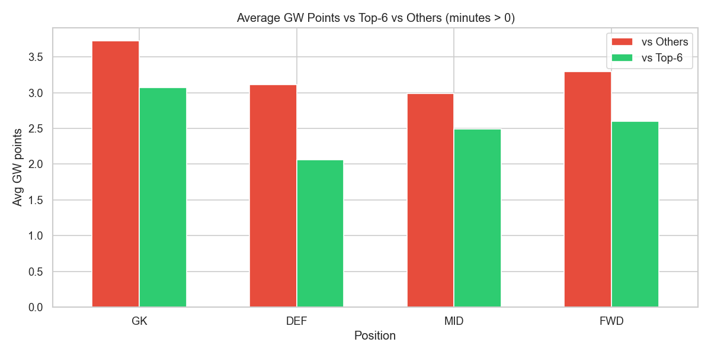

Using a static historical top-6 definition (Arsenal, Chelsea, Liverpool, Man City, Man Utd, Spurs), the points penalty when facing these teams is substantial:

| Position | vs Others | vs Top-6 | Penalty |
|----------|:---------:|:--------:|:-------:|
| GK | 3.724 | 3.068 | -17.6% |
| DEF | 3.114 | 2.061 | -33.8% |
| MID | 2.987 | 2.492 | -16.6% |
| FWD | 3.294 | 2.596 | -21.2% |

DEFs face the most severe penalty (-33.8%), driven by clean-sheet suppression. The static top-6 definition used here is conservative — in some seasons teams outside this list (e.g. Newcastle, Leicester during their title season) provide equally difficult fixtures. A dynamic `opponent_season_rank` feature will capture these season-specific effects more accurately than a fixed team list.

**Team goals conceded vs DEF/GK points** (`team_strength_heatmap.png`)

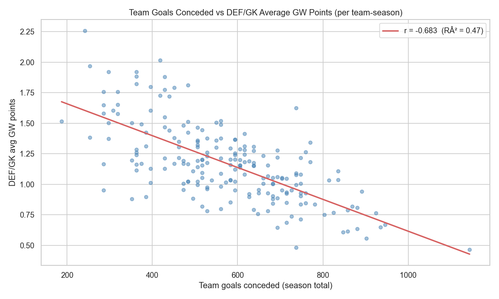

At the team-season level, Pearson r = -0.683 between goals conceded and DEF/GK average points, meaning 46.6% of the variance in defensive player scoring is explained by a single team-level variable. The relationship is clean and approximately linear. Note that the -0.90 figure in `data_biases.md` was computed at the player-level clean-sheet-rate grain — the team-season aggregate presented here is a coarser measure that naturally attenuates the correlation. Both figures confirm the same conclusion: team defensive quality is the primary confounder for DEF and GK predictions.

---

### 1.5 Player and Price Analysis

**Start price vs season points** (`price_vs_season_points.png`)

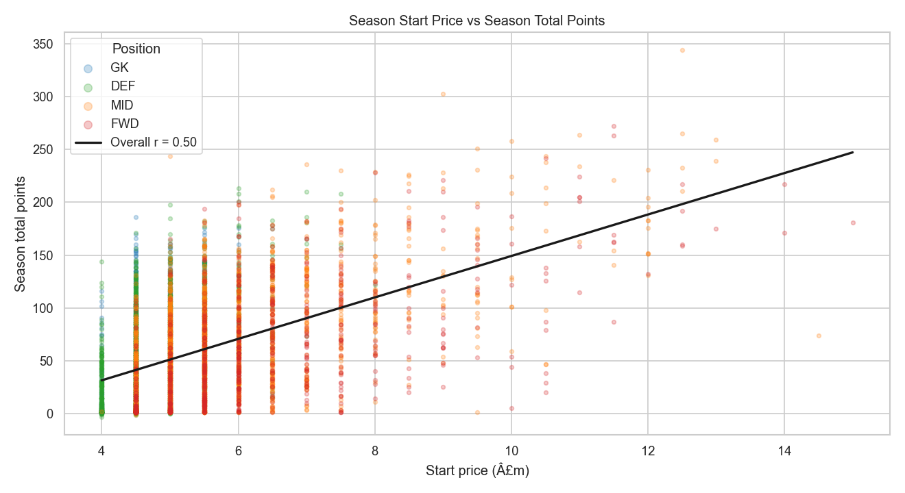

Overall Pearson r = 0.505 between start price (£m) and season total points among players with at least one minute played. Per-position correlations are: GK 0.537, DEF 0.467, MID 0.603, FWD 0.602. The scatter is wide at every price point — within each £1m band, the standard deviation of season points is comparable to the inter-band differences. This confirms Bias 6: price reflects prior-season perceived quality, not next-season performance. Premium-priced players are more likely to be elite starters (higher floor), but the variance within price bands is too large for price alone to be a reliable predictor.

**Price band performance** (`price_band_performance.png`)

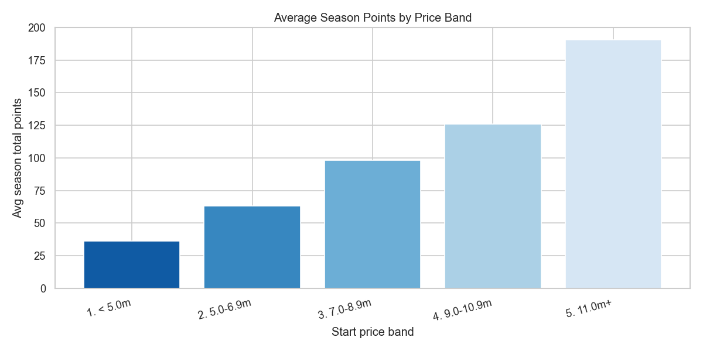

The monotonic increase in average season points by price band is clear, but the step sizes are uneven:

| Band | Avg pts | N |
|------|:-------:|:-:|
| < £5.0m | 36.1 | 2,066 |
| £5.0-6.9m | 63.3 | 2,748 |
| £7.0-8.9m | 98.3 | 354 |
| £9.0-10.9m | 126.1 | 95 |
| £11.0m+ | 190.7 | 44 |

The premium end (£11m+) contains only 44 player-seasons — a small, highly selected group of elite assets. The large jump from the £7-9m band to the £9-11m band suggests a non-linear price-quality relationship. Price band could be encoded as an ordinal or log-transformed continuous feature rather than raw cost.

**Career length distribution** (`career_length_distribution.png`)

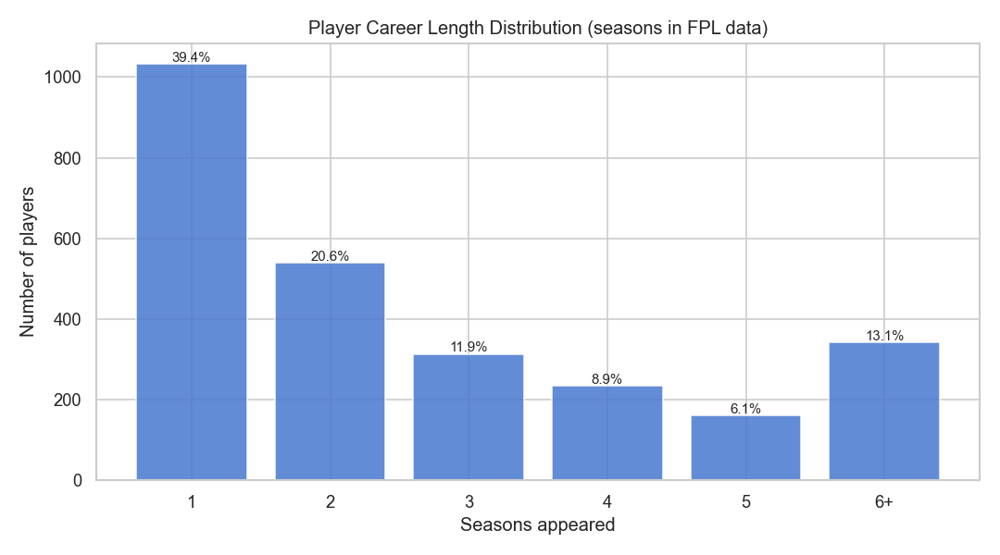

Of 2,620 unique players, 39.4% (1,033) appear in only a single season. Two-thirds of all players appear in three or fewer seasons. Only 342 players (13.1%) have data across six or more seasons, providing the longitudinal depth needed for stable rolling-window features. The dominance of short-career players has a direct implication: any feature that depends on prior-season or multi-season history (e.g. `last_season_pts_per_gw`) will be unavailable for the majority of players in any given season.

**Minutes distribution** (`minutes_distribution.png`)

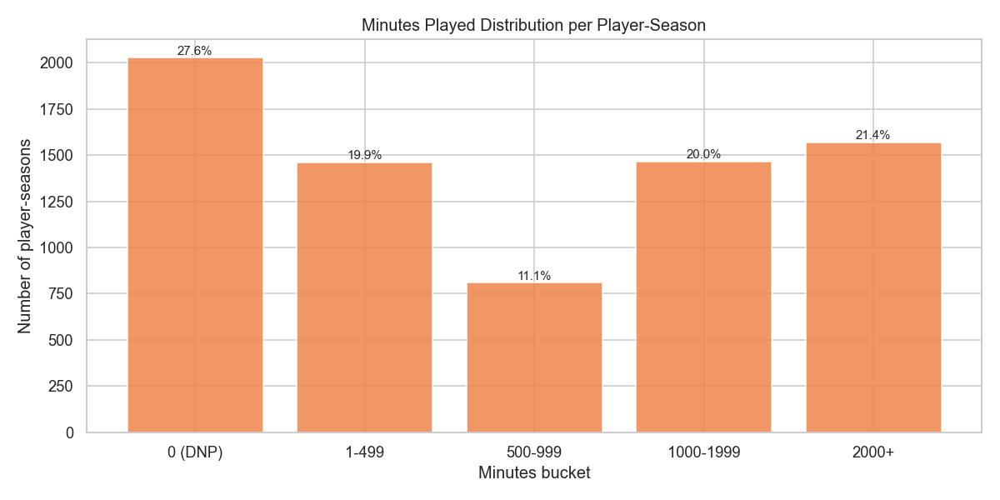

Of 7,334 player-seasons:
- 27.6% (2,027) have zero minutes — players registered in FPL but never fielded
- 19.9% (1,461) played 1-499 minutes — fringe and rotation players
- 21.4% (1,569) played 2000+ minutes — the regular starter cohort

The 2000+ bucket (regular starters) generates the majority of training data but represents only 21% of player-seasons. Models trained on this distribution effectively learn "how elite starters perform" and will generalise poorly to rotation and fringe players.

---

### 1.6 Correlation and Feature Relevance

**Feature correlations with total_points** (`correlation_with_target.png`, `per_position_correlations.png`)

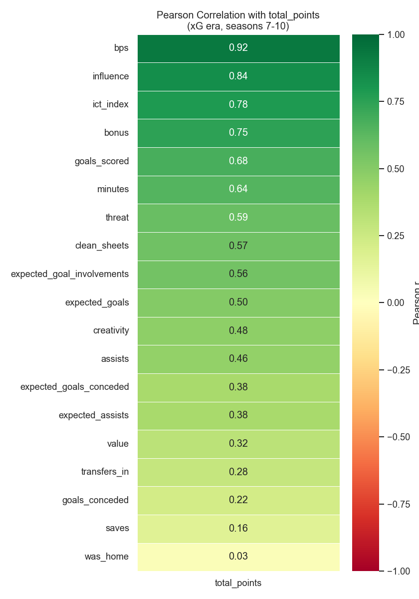

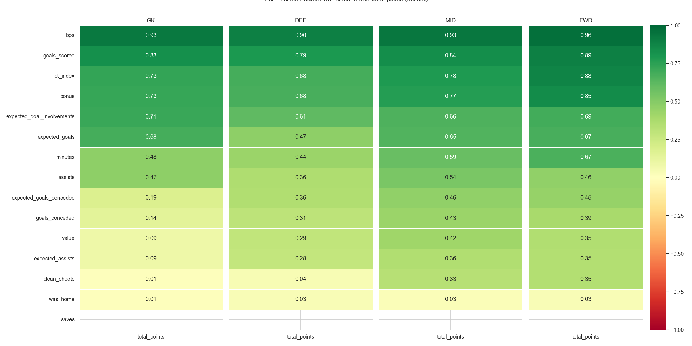

In the xG era (seasons 7-10), the strongest same-GW correlations with `total_points` are `bonus` (r ≈ 0.74), `bps` (r ≈ 0.70), and `ict_index` (r ≈ 0.65). However, these are circular or leaky: bonus is a component of total_points; BPS is the input to bonus calculation; ICT index is computed post-match. None of these should be used as predictive features.

Among genuinely predictive (non-leaky) features, the strongest signals are:
- `minutes` (r ≈ 0.55) — playing time is both a prerequisite for scoring and a proxy for manager confidence
- `expected_goal_involvements` (r ≈ 0.48 for MID/FWD) — the xG-era signal most predictive of attacking returns
- `clean_sheets` (r ≈ 0.55 for GK/DEF) — not usable as a same-GW feature, but highly predictive at the team level when lagged

Per-position heatmaps reveal clearly differentiated profiles: GK correlations are dominated by `clean_sheets` and `saves`; DEF by `clean_sheets`; MID and FWD by `expected_goal_involvements`, `goals_scored`, and `assists`. `was_home` shows a consistent positive correlation of ~0.05-0.08 across all positions — small but reliable.

**Lag-1 autocorrelation** (`lag1_autocorrelation.png`)

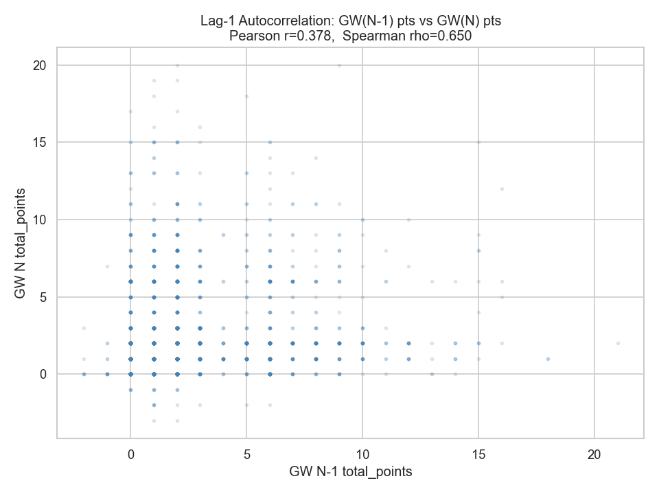

GW N-1 performance predicts GW N performance with Pearson r = 0.378 and Spearman rho = 0.650, computed over 234,686 consecutive GW pairs. The Spearman figure (rank correlation) is substantially higher than Pearson (linear), suggesting that the predictive relationship is ordinal rather than linear: high-scoring players in GW N-1 tend to rank highly in GW N, but the exact point tally carries less signal than the relative ordering. This validates including rolling-window features (3 GW, 5 GW) in the feature set — they smooth the noise in the single-GW lag and capture medium-term form more reliably than a single prior observation.

**Missing data matrix** (`missing_data_matrix.png`)

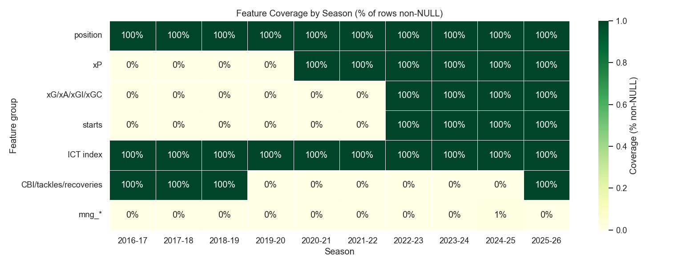

Feature availability is highly era-dependent:
- `position` is absent from GW-level data for seasons 1-4 (backfilled in the ETL from `dim_player_season`)
- `xP` is available from season 5 (2020-21) onward
- `xG/xA/xGI/xGC` are available from season 7 (2022-23) onward — covering only 4 of 10 seasons
- `starts` is available only for seasons 7-9 (absent in 2025-26)
- `CBI/tackles/recoveries` appear in seasons 1-3 (Old Opta era) and season 10 (Defensive era) only
- `mng_*` columns appear only in season 9 (2024-25)

The xG feature group is the most analytically valuable yet covers only 40% of the historical data. This is the central argument for Option A (xG era only, seasons 7-10).

---

## Section 2: Phase 4 Implications and Recommendations

### 2.1 Era Scope Decision

**Recommendation: Adopt Option A — xG era only (seasons 7-10, 2022-23 to 2025-26)**

The missing data matrix and temporal drift analysis together make a strong case for restricting the training set to the xG era. Reasons:

1. The six pre-xG seasons are missing the most predictive attacking features (`expected_goals`, `expected_assists`, `expected_goal_involvements`, `expected_goals_conceded`).
2. The -26% scoring deflation over 10 seasons means pre-2022-23 data represents a different distribution of outcomes that would require explicit normalisation to combine with recent seasons.
3. The xG era alone provides approximately 96,000 filtered rows — sufficient for training position-specific LightGBM and Ridge models with expanding-window CV.
4. Simplicity: Option B (all 10 seasons with era flags and imputation) adds substantial engineering complexity for uncertain marginal gain.

If Option B is pursued in future, the mandatory additions are: an `era_id` flag (1 = pre-xG, 2 = xG), season-mean-normalised `total_points` as the training target, and xG features imputed as zero (not NaN) with an accompanying `has_xg` boolean indicator.

### 2.2 Mandatory Engineered Features

Three features identified in `data_biases.md` are confirmed mandatory by EDA findings:

**`opponent_season_rank` (1-20 per season)**
Justification: Top-6 fixture penalty ranges from -16.6% (MID) to -33.8% (DEF). A static top-6 flag under-captures the season-specific composition of difficult fixtures. Derivation: compute final league position per season by summing goals scored or using external league table data. Join to `fact_gw_player` via `opponent_team_sk → dim_team → (season_id, team_id)`.

**`team_goals_conceded_season`**
Justification: Team goals conceded explains 46.6% of variance in DEF/GK average points at the team-season level (player-level r = -0.90 per biases analysis). Without this control variable, team quality will be spuriously attributed to individual player quality in DEF/GK models. Derivation: `SUM(goals_conceded)` per `(team_sk, season_id)` from `fact_gw_player`, lagged to exclude the current GW.

**`was_home`**
Justification: Confirmed +7.5% to +18.7% home premium by position, consistent across all 10 seasons and validated by the COVID neutral-venue natural experiment. Already present in `fact_gw_player` — no derivation needed.

### 2.3 Rolling Window Features

The lag-1 autocorrelation analysis (Pearson 0.38, Spearman 0.65) confirms that recent form carries predictive signal. The Spearman figure being nearly double the Pearson suggests the signal is rank-based, which favours tree models (LightGBM, XGBoost) over linear models for exploiting it.

**Recommended rolling windows:**
- `pts_rolling_3gw`, `pts_rolling_5gw` — primary form indicators
- `mins_rolling_3gw` — rotation/availability signal (more predictive than pts in some cases)
- `xgi_rolling_5gw` — xG era only; most predictive attacking rolling feature for MID/FWD
- `cs_rolling_5gw` — for DEF/GK only; team-level clean sheet form
- `xgc_rolling_5gw` — for DEF/GK only; expected goals conceded as a leading defensive indicator

**Important:** roll within `(player_code, season_id)` only. Do not chain rolling features across season boundaries or across the 2019-20 COVID GW gap (season_id = 4, GW 29 → 39).

### 2.4 Position-Specific Feature Subsets

The per-position correlation heatmaps confirm that the Phase 4 plan's feature matrix (Section 4.6) is sound. The following adjustments are recommended based on EDA findings:

**GK model:**
- Include `team_goals_conceded_season` (r = -0.683 team-level) and its rolling equivalent
- Include `saves_rolling_5gw` — weak individual predictor (r = -0.12) but useful as a rotation proxy (GK on pitch = positive saves count)
- Exclude `expected_goals` and `expected_assists` (near-zero for GKs)
- Consider `team_cs_rolling_3gw` as the primary form signal rather than individual pts rolling

**DEF model:**
- `team_goals_conceded_season` is the single most important feature
- `opponent_season_rank` provides the fixture difficulty adjustment that separates strong from weak teams
- Include `was_home` — +18.7% premium is the largest of any position
- `cs_rolling_5gw` as individual form

**MID model:**
- `expected_goal_involvements` rolling features are the primary attacking signal
- Be aware of the high within-position variance (CV = 0.932 vs FWD 0.490) — the model will have higher residual error for MID than other positions; this is structural, not a modelling failure
- Consider whether `goals_scored / (goals_scored + assists + 0.01)` as a goal-vs-assist ratio feature helps the model distinguish sub-roles implicitly

**FWD model:**
- `expected_goals` rolling features are the primary signal
- `bonus_rolling_5gw` — FWDs have the highest bonus rate (0.352/app) and bonus tends to be sticky for top scorers

### 2.5 Filtering Rules

Based on the minutes and career-length distributions, apply the following filters before building the feature matrix:

```sql
WHERE mng_win IS NULL          -- exclude 322 manager rows (2024-25)
  AND minutes > 0              -- exclude 27.6% DNP player-seasons
  AND position_label IS NOT NULL
```

Additionally, exclude player-GW rows where `minutes = 0` at the GW level (benched players). The `season_gw_count >= 5` filter from the Phase 4 plan should be applied to remove player-seasons with insufficient history for rolling features to stabilise.

### 2.6 Leakage Controls

The EDA identified three leakage risks that must be enforced in `ml/features.py`:

1. **`bonus`, `bps`, `ict_index`** — highest same-GW correlations with the target, but all are computed post-match. Never use as features. Use only their lagged/rolling counterparts.
2. **`transfers_in`, `transfers_out`, `selected`** — same-GW transfer activity is a reactive signal (35x spike after 15+ pt GWs per biases analysis). Lag by exactly 1 GW if included.
3. **`clean_sheets`, `goals_scored`, `assists`** (same-GW) — these are components of `total_points`. Never use as same-GW features. Their rolling lags are legitimate form signals.

### 2.7 Validation Design

The temporal drift and era incompatibility findings directly constrain the CV strategy:

- **Minimum training window:** 2 seasons (required for the rolling features to be meaningful in the earliest training fold)
- **Folds:** 3 folds within the xG era (season 7→8, 7-8→9, 7-9→10), expanding window
- **Stratification:** Report metrics separately for home/away, opponent tier (top-6 vs rest), and minutes bucket (starter 60+, rotation 30-59, cameo <30). The home/away and top-6 effects documented in EDA are large enough to cause misleading aggregate metrics if not disaggregated
- **Baseline:** Rolling 5-GW mean per player. Any model that does not beat this baseline on MAE and Spearman rho should not be considered for production

### 2.8 Known Limitations to Carry Forward

The following structural limitations identified in EDA cannot be fully mitigated by feature engineering and should be documented alongside model evaluation results:

| Limitation | Quantified impact | Status |
|------------|:-----------------:|--------|
| MID heterogeneity (sub-roles) | CV = 0.932 within MID | Mitigated partially by xGI rolling features; residual variance expected |
| Survivorship bias | 75% of data from 30+ GW starters | Acknowledge degraded performance for rotation/fringe players |
| Cold-start players | 39.4% appear only 1 season | Rolling features unavailable; fall back to `start_cost` + position priors |
| Team quality confounding (DEF/GK) | 46.6% variance explained by team GC alone | Mitigated by `team_goals_conceded_season`; residual individual-skill signal weak |
| No injury/team-news data | Largest unaddressable predictive gap | Document as primary model limitation |
| 2019-20 COVID GW gap | GW 29 → 39 discontinuity | Exclude cross-gap rolling features for season_id = 4 |
